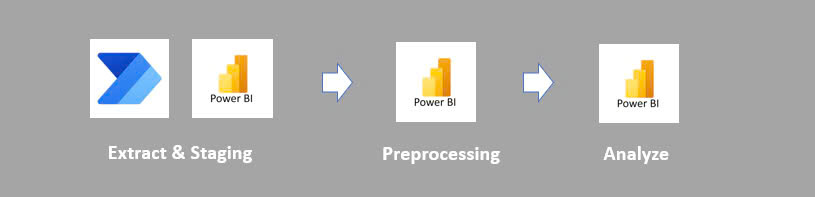
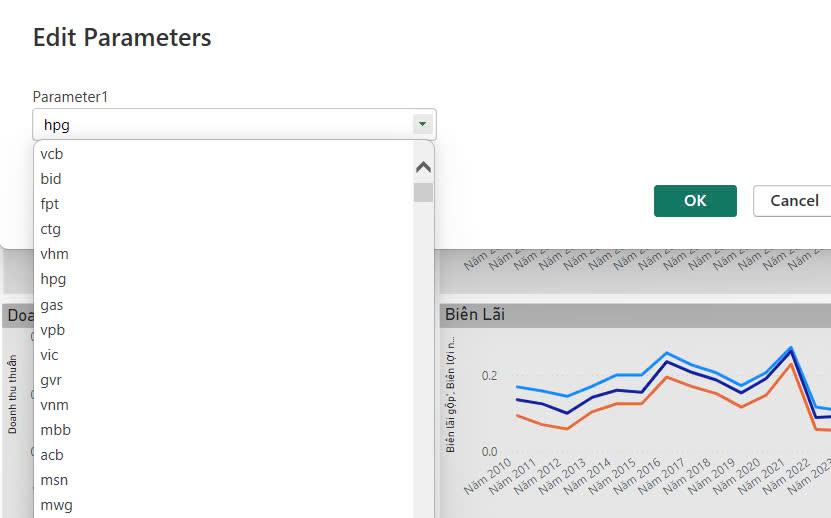
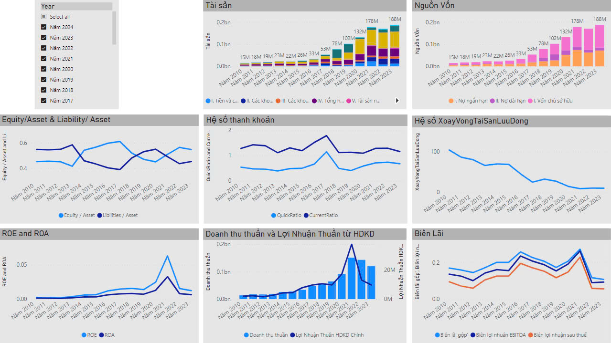

# README - Power BI Dashboard for Financial Data Analysis

## 1. Project Overview

This Power BI dashboard project is designed to extract, preprocess, and analyze financial data from **Cophieu68.com**, a popular stock information website in Vietnam. The project follows a clear pipeline, including data extraction, staging, preprocessing, and final analysis for decision-making.

The purpose of this project is to provide clear insights into the financial health of various companies by analyzing several key metrics, such as assets, liabilities, liquidity ratios, profitability, and efficiency ratios. 

## 2. Key Features

### 2.1. Data Extraction and Staging

- **Source:** Raw financial data from **Cophieu68.com** is integrated into Power BI for further processing. 
- **Extract and Stage:** The data is extracted and staged within Power BI for preprocessing.
  

### 2.2. Data Preprocessing

**Transformation:** After data extraction, it undergoes cleaning and preprocessing.
- Missing values are handled, and necessary columns are selected for visual analysis.
- Standardize data structure to be suitable for all company

### 2.3. Company Selection

- A parameterized filter allows the user to select different companies (e.g., HPG, BID, FPT) for focused analysis. 
- Dynamic filtering allows comparison across multiple years and financial metrics.

  

### 2.4. Data Analysis

The dashboard provides visual insights into different aspects of company financials:

- **Assets and Capital:** Provides a view of the company’s total assets and capital over the years.
- **Equity and Liabilities:** Analysis of the equity and liability ratio to assess the financial structure.
- **Liquidity Ratios:** Evaluation of the Quick and Current Ratios to assess liquidity and short-term financial health.
- **Profit Margins and Return on Assets:** These metrics provide insights into the profitability of the companies.
  

## 3. Instructions to Use

1. **Open Power BI File:** Load the provided `.pbix` file into Power BI Desktop.
2. **Data Refresh:** Ensure the data source (Cophieu68.com) is connected and up-to-date.
3. **Select Parameters:** Use the "Edit Parameters" option to choose the desired company from the dropdown list.
4. **Visualize Data:** Interact with the dashboard by filtering different years or financial metrics.

## 3. Conclusion

This Power BI dashboard offers a comprehensive analysis of financial data for various companies. By utilizing the interactive visualizations, users can easily gain insights into a company's financial health and SAVE MONEY BY NOT USING PUBLIC WEBSITE
